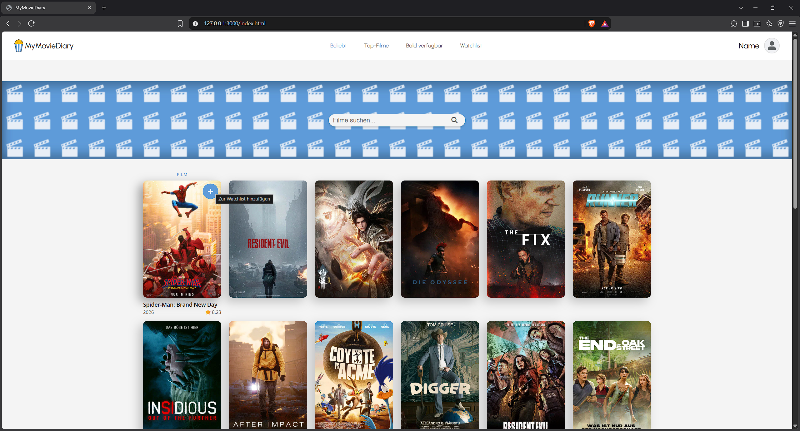

# MyMovieDiary

Eine Web-Anwendung zum Entdecken und Merken von Filmen und Serien, gebaut mit HTML, CSS und JavaScript (jQuery) und angebunden an die [TMDB-API](https://www.themoviedb.org/). Nutzer:innen können beliebte, bestbewertete und bald erscheinende Filme durchstöbern, gezielt nach Filmen, Serien oder Personen suchen und Titel mit einem Klick auf ihre persönliche Watchlist setzen. Die Watchlist bleibt im Browser gespeichert, und die Oberfläche lässt sich zwischen Light- und Dark-Mode umschalten.

## Features

- **Entdecken:** Ansichten für *Beliebt*, *Top-Filme* und *Bald verfügbar* (kommende Kinostarts in Deutschland)
- **Suche** per Enter oder Klick auf die Lupe, filterbar nach *Alle*, *Filme*, *Serien* und *Personen*
- **Watchlist:** Titel per Button direkt auf der Karte hinzufügen oder entfernen, eigene Watchlist-Seite
- **Persistenz im Browser:** Watchlist, Theme und zuletzt gewählte Ansicht werden im `localStorage` gespeichert, ganz ohne Backend oder Login
- **Light- und Dark-Mode**, umschaltbar über das Einstellungs-Modal
- **Deutschsprachige Inhalte** (Titel und Beschreibungen von TMDB auf Deutsch)
- **Fehlerhinweis**, wenn die API nicht erreichbar ist oder der Token fehlt

## Tech-Stack

- HTML5, CSS3
- JavaScript (ES6+) mit jQuery 4
- [TMDB-API](https://developer.themoviedb.org/docs) (Daten und Poster)
- Font Awesome (Icons), Google Fonts (Urbanist, Open Sans)

## Installation

1. Repository klonen und in den Ordner wechseln
2. TMDB-Account anlegen und den **API Read Access Token** kopieren
3. `assets/config.example.js` nach `assets/config.js` kopieren und den Token eintragen
4. `index.html` mit einem lokalen Server (z. B. Live Server) öffnen
